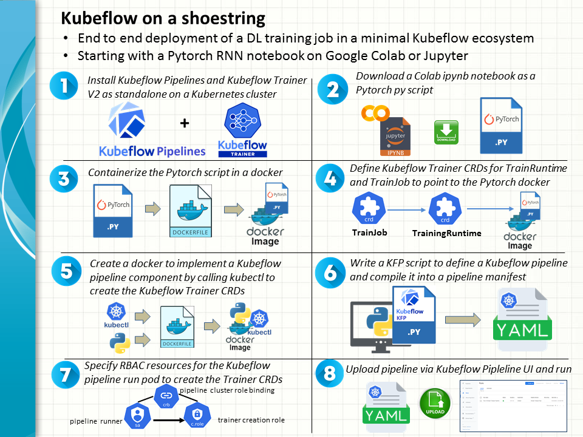
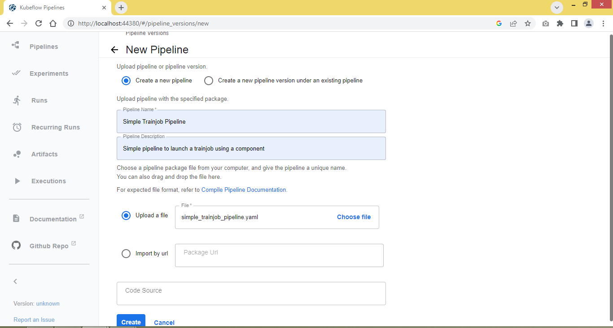
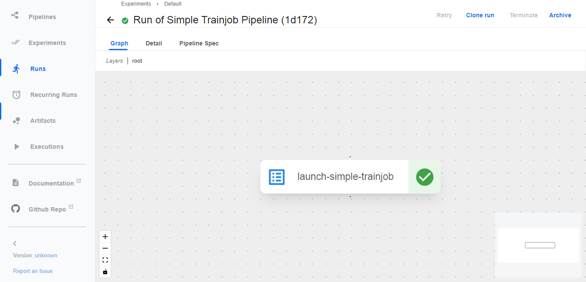
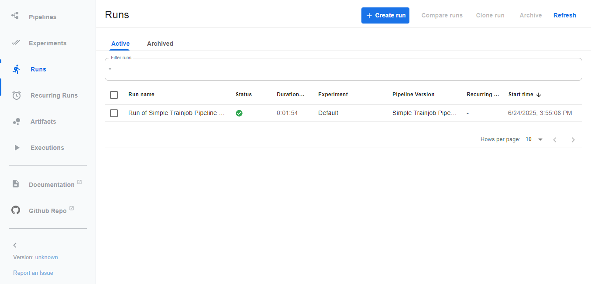

## Kubeflow Quickstart

In this lab, we will walk you through the steps of uplifting a sample Pytorch deep learning notebook to Kubeflow on a shoestring, so to speak:
* Minimal Kubeflow ecosystem: Kubeflow Pipelines + Kubeflow Trainer V2
* Small footprint: Kind Kubernetes(1.32 or later) on a compute instance or VM, etc of 4GB memory and 20GB free disk space
* A working Pytorch notebook on Google Colab or Jupyter

The exercise may serve as a entry template for future extension to other Kubflow components like Katib, Model Registry or more complicated train jobs.

### TL; DR



### Step by step walk through

1. Install Kubeflow Pipelines and Kubeflow Trainer V2
2. Download a chosen Pytorch notebook as a python script
3. Containerize the python script in a docker
4. Define the Kubeflow Trainer CRDs Trainjob and Trainingruntime
5. Prepare a docker image for the task of creating the Trainjob and Trainingruntime CRDs
6. Write a KFP script to define a Kubeflow pipleline job
7. Sort out RBAC beteen Kubeflow pipeline and Kubeflow Trainer
8. Upload the pipeline manifest and run the pipeline on the Kubeflow Pipeline UI

#### 1. Install Kubeflow Pipeline and Kubeflow Trainer V2 as standalone components

Install Kubeflow Piplines according to the [official guide](https://www.kubeflow.org/docs/components/pipelines/operator-guides/installation/).

```
export PIPELINE_VERSION=2.4.0
kubectl apply -k "github.com/kubeflow/pipelines/manifests/kustomize/cluster-scoped-resources?ref=$PIPELINE_VERSION"
kubectl wait --for condition=established --timeout=60s crd/applications.app.k8s.io
kubectl apply -k "github.com/kubeflow/pipelines/manifests/kustomize/env/dev?ref=$PIPELINE_VERSION"
```

Heads up: When installing from the offical repo, the peristent volume claim (PVC) is set to 20GB each for the mino and mysql pods on the Kubeflow Pipelines control plane. As an alternative, version 2.4.0 of the offical repo is cloned into my github account with the PVC reduced to 10GB each for both pods. It is served at the master branch here. If necessary, you may opt to install the custom repo as follows.

```
kubectl apply -k "github.com/snpsuen/kubeflow-pipelines/manifests/kustomize/cluster-scoped-resources?ref=master"
kubectl wait --for condition=established --timeout=60s crd/applications.app.k8s.io
kubectl apply -k "github.com/snpsuen/kubeflow-pipelines/manifests/kustomize/env/platform-agnostic?ref=master"
```

Install Kubeflow Trainer according to the [official guide](https://www.kubeflow.org/docs/components/trainer/operator-guides/installation/).

```
kubectl apply --server-side -k "https://github.com/kubeflow/trainer.git/manifests/overlays/manager?ref=master"
kubectl apply --server-side -k "https://github.com/kubeflow/trainer.git/manifests/overlays/runtimes?ref=master"
```

#### 2. Download a chosen Pytorch notebook as a python script

Suppose you have chosen a working Pytorch notebook from Google Colab or Jupyter. Click *File->Download as* on the UI to download it as a python py script.

In this example, the lab uses a [simple Pytorch notebook](artifact/Pytorch_RNN_LSTM_AT_example05.ipynb) in the artiface directory of this repo. It is adapted from a Pytorch script written by Adrian Tam to train an LSTM DL model to predict about the number of airline passengers in a time series [(see here)](https://machinelearningmastery.com/lstm-for-time-series-prediction-in-pytorch/). The notebook sample has been downloaded as [pytorch_rnn_lstm_at_example05.py](artifact/pytorch_rnn_lstm_at_example05.py).

Point to note: To reduce execution time, our sample Pytorch notebook uses only 100 epochs to train the LSTM model concerned, which is far from satisfactory. As the model is seriously undertrained, the end product will be deemed very rudimentary or impractical. Neveretheless, our main focus here is about getting the script started and completed properly as a train job in a Kubeflow pipeline.

#### 3. Containerize the python script in a docker

Create a docker image based on python:3.13.5-slim-bookworm and install the packages pytorch, pandas and matplotlib overlay. <br>
Specify *python ./pytorch_rnn_airpass_example05.py* as the default command to run when a container starts from the image.

In this example, the docker image is created and tagged as snpsuen/pytorch_rnn_airpass:05 under the default docker.io registry.

```
cat > Dockerfile <<EOF
FROM python:3.13.5-slim-bookworm
RUN pip install torch==2.6.0 torchvision==0.21.0 torchaudio==2.6.0 --index-url https://download.pytorch.org/whl/cpu && pip install pandas matplotlib
RUN mkdir /workspace
WORKDIR /workspace
COPY ./pytorch_rnn_airpass_example05.py .
CMD [ "python", "./pytorch_rnn_airpass_example05.py"]
EOF

docker build -t snpsuen/pytorch_rnn_airpass:05 .
docker push snpsuen/pytorch_rnn_airpass:05
```

#### 4. Define the Kubeflow Trainer CRDs Trainjob and Trainingruntime

Create a namespace called training and define a Traingruntime CRD called pytorch-simple-runtime in that namespace for Kubeflow Trainer V2. <br>
In particular, pytorch-simple-runtime encompasses a replicated job that uses the docker image snpsuen/pytorch_rnn_airpass:05 created earlier in step 3.

```
kubectl create ns training
cat > pytorch-simple-trainer.yaml <<EOF
apiVersion: trainer.kubeflow.org/v1alpha1
kind: TrainingRuntime
metadata:
  name: pytorch-simple-runtime
  namespace: training # Or the namespace where your runtime will live
spec:
  template:
    metadata:
      name: pyrt-simple
      namespace: training
    spec:
      replicatedJobs:
        - name: pyrt-rj
          replicas: 1
          template:
            metadata:
              name: pyrt-rj-simple
              namespace: training
            spec:
              template:
                metadata: 
                  name: pyrt-simple-pod
                  namespace: training
                spec:
                  containers:
                    - command:
                        - "python"
                        - "/workspace/pytorch_rnn_airpass_example05.py"
                      image: snpsuen/pytorch_rnn_airpass:05
                      imagePullPolicy: Always
                      name: pyrt-simple-container
---
EOF
```

Similarly, define a TraingJob CRD called pytorch-simple-trainjob in training namespace for Kubeflow Trainer V2. <br>
More specifically, pytorch-simple-trainjob points to pytorch-simple-runtime in the .spec.runtimeRef fields.

```
cat >> pytorch-simple-trainer.yaml <<EOF
apiVersion: trainer.kubeflow.org/v1alpha1
kind: TrainJob
metadata:
  name: pytorch-simple-trainjob
  namespace: training # Or the namespace where your runtime will live
spec:
  runtimeRef:
    kind: TrainingRuntime
    name: pytorch-simple-runtime
EOF
```

You may find the two CRD manifests combined into a single yaml file [pytorch-simple-trainer.yaml](artifact/pytorch-simple-trainer.yaml) in the artiface directory.

#### 5. Prepare a docker image for creation of the Trainjob and Trainingruntime CRDs

Create another docker image that includes the binaries kubectl. The command *kubectl apply -f manifests.yaml* will be executed in a container running from the image to create the Trainingruntime and TrainJob CRDs as defined in step 4. Such a container will be deployed inside a pipeline run pod served by Kubectl Pipelines.

More specifically, the docker image is based on python:3.10-slim with the binaries /usr/local/bin/kubectl installed overlay.

```
cat > Dockerfile <<EOF
FROM python:3.10-slim

ENV KUBECTL_VERSION=v1.30.1

# Install dependencies and kubectl
RUN apt-get update && apt-get install -y curl ca-certificates && \
    curl -LO https://dl.k8s.io/release/${KUBECTL_VERSION}/bin/linux/amd64/kubectl && \
    install -o root -g root -m 0755 kubectl /usr/local/bin/kubectl && \
    rm kubectl && \
    apt-get clean && rm -rf /var/lib/apt/lists/
EOF

docker build -t snpsuen/python-3.10-kubectl:v01 .
docker push snpsuen/python-3.10-kubectl:v01
```

In this example, the docker image is created and tagged as snpsuen/python-3.10-kubectl:v01 under the default docker.io registry.

#### 6. Write a KFP script to define a Kubeflow pipleline job

Write a KFP python script named simple_trainjob_pipeline.py to define a pipeline and a component responsible for running the pipeline. In this lab, the component will be implemented as a container where python is called to execute the command *kubectl apply -f https://raw.githubusercontent.com/snpsuen/Deep_Learning_Data/refs/heads/main/script/pytorch-simple-trainer.yaml* and create the featured TrainingRuntime and TrainJob CRDs.

The script is subsequently compiled into a pipeline definition yaml, simple_trainjob_pipeline.yaml, which will be uploaded to Kubeflow Pipelines in step 8.

```
cat > simple_trainjob_pipeline.py <<EOF
import kfp
from kfp import dsl

@dsl.component(base_image='snpsuen/python-3.10-kubectl:v01')
def launch_simple_trainjob():
    import subprocess
    subprocess.run([
        "kubectl", "apply", "-f",
        "https://raw.githubusercontent.com/snpsuen/Deep_Learning_Data/refs/heads/main/script/pytorch-simple-trainer.yaml"
    ], check=True)
    print("Simple trainjob has been submitted.")

@dsl.pipeline(
    name="Simple Trainjob Pipeline",
    description="Simple pipeline to launch a trainjob using a component"
)
def simple_trainjob_pipeline():
    launch_simple_trainjob()

if __name__ == "__main__":
    from kfp import compiler
    compiler.Compiler().compile(simple_trainjob_pipeline, "simple_trainjob_pipeline.yaml")
EOF

python simple_trainjob_pipeline.py
```

#### 7. Sort out RBAC beteen Kubeflow pipeline and Kubeflow Trainer

Before submitting your pipeline to Kubeflow Pipelines, it is necessary to grant proper RBAC permissios to a pod created by Kubeflow Pipelines so that it is allosed to create and process the Kubeflow Trainer CRDs TrainingRuntime and TrainJob.

<table>
	<thead>
		<tr>
			<th scope="col" align="left">Source: Service Account</th>
			<th scope="col" align="left">Source: Namespace</th>
			<th scope="col" align="left">Target: API Group</th>
			<th scope="col" align="left">Target: CRDs</th>
			<th scope="col" align="left">Target: Actions</th>
		</tr>
	</thead>
	<tbody>
		<tr>
			<td>pipeline-runner</td>
			<td align="left">kubeflow</td>
			<td align="left">Kubeflow Trainer</td>
			<td align="left">TrainingRuntime<br>TrainJob</td>
			<td align="left">get, list, create, update, patch</td>			
		</tr>
	</tbody>
</table>

Define a ClusterRole resource to cater for creating, reading and other relevant operations on the TrainingRuntime and TrainJob CRDs.

```
cat > rbac_pipeline-runner_trainjob.yaml <<EOF
apiVersion: rbac.authorization.k8s.io/v1
kind: ClusterRole
metadata:
  name: trainjob-crd-access
rules:
  - apiGroups: ["trainer.kubeflow.org"]
    resources: ["trainjobs", "trainingruntimes"]
    verbs: ["get", "list", "create", "update", "patch"]
---
EOF
```

Define a ClusterRoleBinding resource to assign the above ClusterRole to the designated service account pipeline-runner in the kubeflow namespace.

```
cat >> rbac_pipeline-runner_trainjob.yaml <<EOF
apiVersion: rbac.authorization.k8s.io/v1
kind: ClusterRoleBinding
metadata:
  name: allow-pipeline-runner-to-create-traincrd
roleRef:
  apiGroup: rbac.authorization.k8s.io
  kind: ClusterRole
  name: trainjob-crd-access
subjects:
- kind: ServiceAccount
  name: pipeline-runner
  namespace: kubeflow
EOF

kubectl apply -f ./rbac_pipeline-runner_trainjob.yaml
```

#### 8. Submit the pipeline manifest and run the pipeline on the Kubeflow Pipeline UI

Thank you for your time and patience. If you get to this point, you are all set to submit the pipeline created in this lab to Kubeflow Pipelines and run it aftewrard.
First, let's forward port 80 of the pipeline ui to a chosen port on your compute instance or VM, say 44380 in this exampe.
```
kubectl port-forward -n kubeflow svc/ml-pipeline-ui 44380:80
```

Make sure there are other port forwarding rules in place to forward the VM port such as 44380 to a valid one on your endpoint device, say 44380 again.

Open the Kubeflow Pipelines UI at http://localhost:44380, click \[+ Upload pipeline\] to enter the New Pipeline page. Fill in the pipeline particulars and click \[create\]. 



In this example, the new pipeline is named *Simple Trainjob Pipeline*. Click \[+ Create run \] to start running the pipeline. Fill in the pipeline and run particulars and click \[start\] to run.


Observe the pipeline completed the run successfully.




The pipeline is launched by the following pods on the Kubeflow Pipelines data plane.
```
keyuser@ubunclone:~$ kubectl -n kubeflow get pod | grep simple
simple-trainjob-pipeline-7dgpp-system-container-driver-3957747752   0/2     Completed   0               64m
simple-trainjob-pipeline-7dgpp-system-container-impl-3880865438     0/2     Completed   0               63m
simple-trainjob-pipeline-7dgpp-system-dag-driver-377580790          0/2     Completed   0               64m
```

In particular, simple-trainjob-pipeline-7dgpp-system-container-impl-3880865438 is the pipeline run pod where a container is started from the image snpsuen/python-3.10-kubectl:v01 \(step 5\). It is in this container that the command *kubectl apply -f https://raw.githubusercontent.com/snpsuen/Deep_Learning_Data/refs/heads/main/script/pytorch-simple-trainer.yaml* is executed to create the Kubectl Trainer CRDs TrainingRuntime and TrainJob.

```
keyuser@ubunclone:~$ kubectl -n training get trainjob
NAME                      STATE      AGE
pytorch-simple-trainjob   Complete   5m28s
keyuser@ubunclone:~$
keyuser@ubunclone:~$ kubectl -n training get trainingruntime
NAME                     AGE
pytorch-simple-runtime   5m33s
keyuser@ubunclone:~$ kubectl -n training get pod
NAME                                        READY   STATUS      RESTARTS   AGE
pytorch-simple-trainjob-pyrt-rj-0-0-r6dnq   0/1     Completed   0          5m8s
```

As shown above, pytorch-simple-trainjob and pytorch-simple-runtime are respectively the TrainJob and TrainingRuntime custom resources created by executing the kubectl apply command in the pipeline run pod, simple-trainjob-pipeline-7dgpp-system-container-impl-3880865438.

In the meantime, pytorch-simple-trainjob-pyrt-rj-0-0-r6dnq is the train job run pod that is instrumental in running a container from the image snpsuen/pytorch_rnn_airpass:05 \(step 3\). It is in this container that our sample Pytorch DL script, pytorch_rnn_airpass_example05.py, is executed.

Finally, examine the logs of the pod for the output from pytorch_rnn_airpass_example05.py.
```
keyuser@ubunclone:~$ kubectl -n training logs pytorch-simple-trainjob-pyrt-rj-0-0-j7vzm
/workspace/pytorch_rnn_airpass_example05.py:108: DeprecationWarning: __array_wrap__ must accept context and return_scalar arguments (positionally) in the future. (Deprecated NumPy 2.0)
  train_rmse = np.sqrt(mseloss(y_pred, y_train))
/workspace/pytorch_rnn_airpass_example05.py:110: DeprecationWarning: __array_wrap__ must accept context and return_scalar arguments (positionally) in the future. (Deprecated NumPy 2.0)
  test_rmse = np.sqrt(mseloss(y_pred, y_test))
/workspace/pytorch_rnn_airpass_example05.py:130: DeprecationWarning: __array__ implementation doesn't accept a copy keyword, so passing copy=False failed. __array__ must implement 'dtype' and 'copy' keyword arguments.
  train_plot[lookback:train_size] = model(X_train)
/workspace/pytorch_rnn_airpass_example05.py:134: DeprecationWarning: __array__ implementation doesn't accept a copy keyword, so passing copy=False failed. __array__ must implement 'dtype' and 'copy' keyword arguments.
  test_plot[train_size+lookback:len(timeseries)] = model(X_test)
(1) Reading airline passengers CSV ...

Type of df =  <class 'pandas.core.frame.DataFrame'>
df.shape =  (144, 2)
Type of timeseries =  <class 'numpy.ndarray'>
timeseries.shape =  (144, 1)
Type of train =  <class 'numpy.ndarray'>
train.shape =  (100, 1)
Type of test =  <class 'numpy.ndarray'>
test.shape =  (44, 1)
Type of forecast =  <class 'numpy.ndarray'>
forecast.shape =  (4, 1)
(2) Preparing DL training and testing datasets ...

Type of X_train, type of y_train =  <class 'torch.Tensor'> <class 'torch.Tensor'>
X_train.shape(samples, timesteps, features), y_train.shape(samples, features) =  torch.Size([96, 4, 1]) torch.Size([96, 1])
Type of X_test, type of y_test =  <class 'torch.Tensor'> <class 'torch.Tensor'>
X_test.shape(samples, timesteps, features), y_test.shape(samples, features) =  torch.Size([40, 4, 1]) torch.Size([40, 1])
Type of X_forecast =  <class 'torch.Tensor'>
X_forecast.shape(samples, timesteps, features) =  torch.Size([1, 4, 1])
(3) Setting up an RNN LSTM model ...

(4) Training and evaluating the model ...

Epoch 0: train RMSE 233.9438, test RMSE 427.7932
Epoch 10: train RMSE 227.7156, test RMSE 421.3744
Epoch 20: train RMSE 221.9895, test RMSE 415.4154
Epoch 30: train RMSE 217.1105, test RMSE 410.3401
Epoch 40: train RMSE 212.7082, test RMSE 405.7504
Epoch 50: train RMSE 208.4798, test RMSE 401.3320
Epoch 60: train RMSE 204.3739, test RMSE 397.0318
Epoch 70: train RMSE 200.3581, test RMSE 392.8156
Epoch 80: train RMSE 196.4320, test RMSE 388.6830
Epoch 90: train RMSE 192.5618, test RMSE 384.5982
(5) Forecasting from the model ...

Forecast input =  tensor([[[508.],
         [461.],
         [390.],
         [432.]]])
Forecast output =  tensor([[47.7235]])
(6) Plotting the model ...
```


To be continued ...


