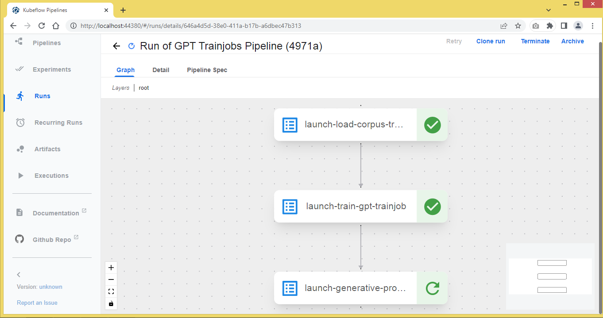
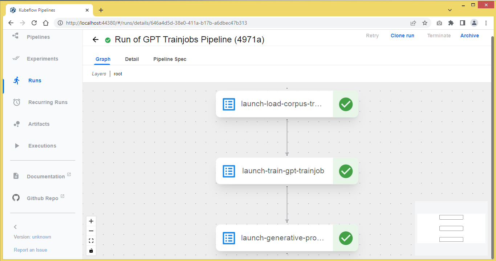
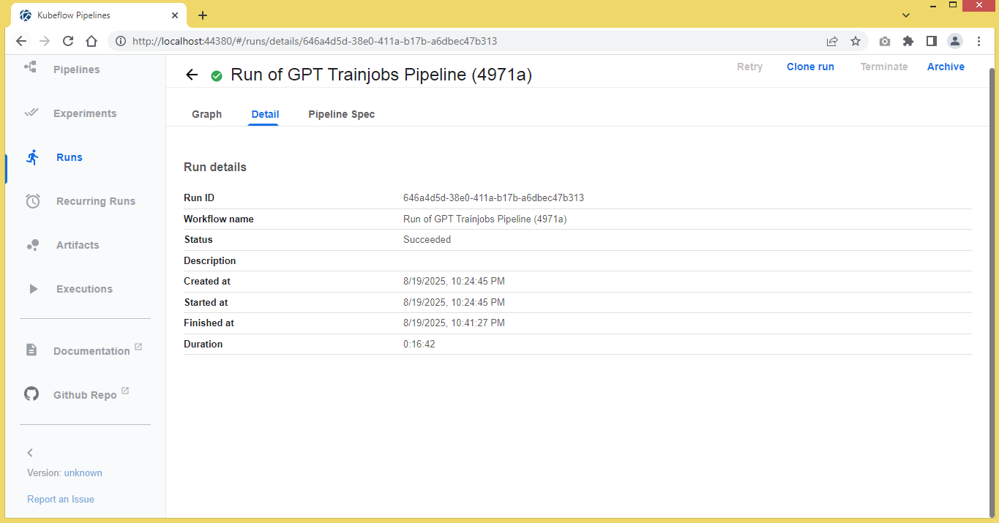

## GPT Training Pipeline

A Kubeflow pipeline is implemented to train up a GPT model from scratch and use it to generate text in response to user prompts. It consists of these task components in order
1. Load corpus data
2. Create and train up a GPT model
3. Run an interactive prompt session to generate text

### TL; DR


### Setup overview

The steps and artifacts taken to build and run the the pipelines are similar those involved in our earlier example of a pipeline of multiple train jobs (see [here](../multiple/readme.md)). You may customise the training data and model hyperparameters by modifying the pytorch scripts to suit your needs. 

In this exercise, we want to minimize the lead time to see quick results. Only a piece of a short literature work, namely Williams Shakespeare's "The Comedy of Errors", is used as a corpus text to train a new GPT model. The model is also configured with small values for such hyperparameters as the number of transformer blocks, training epochs and others.

### Special considerations

There are two points about the Kubeflow Trainer resources that are deployed differently from those in our earlier examples.

First, before applying the trainingruntime and trainjob CRDs, it is necessary to set up a persistent volume claim (PVC) in the Kubernetes cluster. This will enable the ensuing trainjob pods to share the training data and model via a mount point of a persistent volume. To this end, a suitable storageclass is required to support the PVC.

You may consider installing the local-path storageclass provided by Rancher, if you don't have one to start with,
```
kubectl apply -f https://raw.githubusercontent.com/rancher/local-path-provisioner/v0.0.31/deploy/local-path-storage.yaml
kubectl patch storageclass local-path -p '{"metadata": {"annotations":{"storageclass.kubernetes.io/is-default-class":"true"}}}
```

Create a PVC claim to a persistent volume of 128 MB. It will be mounted on the mount point /gpt by the trainjob pods.
```
kubectl apply -f - <<EOF
apiVersion: v1
kind: PersistentVolumeClaim
metadata:
  name: gpt-pvc
  namespace: training
spec:
  accessModes:
    - ReadWriteOnce
  resources:
    requests:
      storage: 128Mi
```

The second point to note is, the worker pod that performs the generative prompt job at the end of the pipeline needs to run in an active mode to generate text in response to user prompts. To this end, the pod is to be assigned a terminal to process standard I/O when it starts up. This is done by enabling the stdin and tty settings for the container serving the trainingruntime CRD, generative-prompt-runtime, (see [generative_prompt_job.yaml](generative_prompt_job.yaml))

```
spec:
  containers:
  - name: generative-prompt-container
    image: snpsuen/toy-gpt:latest
    imagePullPolicy: IfNotPresent
    command: ["python", "/workspace/call_generative_prompt.py"]
    stdin: true
    tty: true
```

### Running the pipeline

Upload the GPT pipeline manifest, gpt_trainjobs_pipeline.yaml, to the Kubeflow pipeline and start a run of the pipeline. Observe the pipeline components run to completion one after another.

Wait for the generative prompt task to start at the end of the pipeline after the completon of the tasks of loading corpus data and training the GPT model.



Check the generative prompt trainjob is running.
```
keyuser@ubunclone:~$ kubectl -n training get trainjob
NAME                    STATE      AGE
generative-prompt-job              2m42s
load-corpus-job         Complete   13m
train-gpt-job           Complete   9m12s
keyuser@ubunclone:~$
keyuser@ubunclone:~$ kubectl -n training get job
NAME                                           STATUS     COMPLETIONS   DURATION   AGE
generative-prompt-job-generative-prompt-rj-0   Running    0/1           2m47s      2m47s
load-corpus-job-load-corpus-rj-0               Complete   1/1           2m43s      13m
train-gpt-job-train-gpt-rj-0                   Complete   1/1           5m25s      9m17s
keyuser@ubunclone:~$ kubectl -n training get pod
NAME                                                   READY   STATUS      RESTARTS   AGE
generative-prompt-job-generative-prompt-rj-0-0-bwbpm   1/1     Running     0          2m36s
load-corpus-job-load-corpus-rj-0-0-zfvgv               0/1     Completed   0          12m
train-gpt-job-train-gpt-rj-0-0-562fv                   0/1     Completed   0          9m6s
keyuser@ubunclone:~$
```

Attach to the running pod of generative-prompt trainjob. Start an interactive session with the trained GPT model to generate text from user prompts.
```
keyuser@ubunclone:~$ kubectl -n training attach -it generative-prompt-job-generative-prompt-rj-0-0-bwbpm
If you don't see a command prompt, try pressing enter.
GPT prompt > Once upon a time,
type(encode(prompt)) =  <class 'list'>
encode(prompt) =  [439, 3177, 698, 3074, 7]
context.shape =  torch.Size([1, 5])

GPT replying > , swamp of Beg sprites ] spent an . If in prevail is to by , sob displeasure will , ruin dined . MERCHANTABILITY is , sir , boat cries me ? sweet is one this is of for , hair with us on me your seen live , highly ,

GPT prompt > A long, long time ago,
type(encode(prompt)) =  <class 'list'>
encode(prompt) =  [43, 2074, 7, 2074, 3074, 7]
context.shape =  torch.Size([1, 6])

GPT replying > ow here had ’ d dost Both OF SYRACUSE madly , OR his much sir why a comfort rate copy , tell ? , and is , this updated for ? Have you thousand mishap we why thou THIS sleep five pay and desert any horse wanting . No me

GPT prompt > Hello, how's it going?
type(encode(prompt)) =  <class 'list'>
encode(prompt) =  [7, 1869, 2680, 1954, 1715, 42]
context.shape =  torch.Size([1, 6])

GPT replying > y what Project liability is , and Though up ’ carries the works I helpless same bought most in the compass indemnify hold Dromio . Nay he doubtfully agreement . If format my MESSENGER the habit Gutenberg have and my visit from she you the almanac indeed of Syracuse Ran

GPT prompt > exit
Goodbye!
```

Upon exit from the prompt session, observe that the pipeline completed sucessfully.





Inspect the ouput logs from all the GPT pipeline components.
```
keyuser@ubunclone:~$ kubectl -n training get pods
NAME                                                   READY   STATUS      RESTARTS   AGE
generative-prompt-job-generative-prompt-rj-0-0-bwbpm   0/1     Completed   0          15m
load-corpus-job-load-corpus-rj-0-0-zfvgv               0/1     Completed   0          25m
train-gpt-job-train-gpt-rj-0-0-562fv                   0/1     Completed   0          21m
keyuser@ubunclone:~$
keyuser@ubunclone:~$
keyuser@ubunclone:~$ kubectl -n training logs load-corpus-job-load-corpus-rj-0-0-zfvgv
--2025-08-19 21:28:37--  https://www.gutenberg.org/cache/epub/1504/pg1504.txt
Resolving www.gutenberg.org (www.gutenberg.org)... 152.19.134.47, 2610:28:3090:3000:0:bad:cafe:47
Connecting to www.gutenberg.org (www.gutenberg.org)|152.19.134.47|:443... connected.
HTTP request sent, awaiting response... 200 OK
Length: 112361 (110K) [text/plain]
Saving to: ‘corpus.txt’

     0K .......... .......... .......... .......... .......... 45%  435K 0s
    50K .......... .......... .......... .......... .......... 91%  622K 0s
   100K .........                                             100% 2.69M=0.2s

2025-08-19 21:28:38 (552 KB/s) - ‘corpus.txt’ saved [112361/112361]

(1) Reading text source ...

type(words) = <class 'list'>
Vocab size (word-level): 3389
type(encode(text)) = <class 'list'>
type(data) = <class 'torch.Tensor'>
data.shape = torch.Size([24687])
Saving data data to /gpt/data.pt ...
Saving vocab_size data to /gpt/vocab_size.pt ...
Saving stoi data to /gpt/stoi.pt ...
Saving itos data to /gpt/itos.pt ...
keyuser@ubunclone:~$
keyuser@ubunclone:~$ kubectl -n training logs train-gpt-job-train-gpt-rj-0-0-562fv
loading vocab_size from /gpt/vocab_size.pt ...
(2) Creating training model ...

loading data from /gpt/data.pt ...
(3) Training model ...

logits.shape =  torch.Size([16, 64, 3389])
targets.shape =  torch.Size([16, 64])
logits.view(-1, vocab_size).shape =  torch.Size([1024, 3389])
targets.view(-1).shape =  torch.Size([1024])
Iter 0 | Loss: 8.2667
Iter 10 | Loss: 7.2855
Iter 20 | Loss: 6.2765
Iter 30 | Loss: 5.8969
Iter 40 | Loss: 6.0151
Iter 50 | Loss: 5.7745
Iter 60 | Loss: 5.8223
Iter 70 | Loss: 5.8406
Iter 80 | Loss: 5.2865
Iter 90 | Loss: 5.4856
Saving trained model weight data to /gpt/trained_weights.pt ...
keyuser@ubunclone:~$
keyuser@ubunclone:~$
keyuser@ubunclone:~$ kubectl -n training logs generative-prompt-job-generative-prompt-rj-0-0-bwbpm
loading vocab_size from /gpt/vocab_size.pt ...
(2) Creating training model ...

Loading trained model weight data from /gpt/trained_weights.pt ...
Loading stoi from /gpt/stoi.pt ...
Loading itos from /gpt/itos.pt ...
(4) Generating text from prompt ...


Toy GPT Interactive Mode (word-level) — type 'exit' to quit.

GPT prompt > Once upon a time,
type(encode(prompt)) =  <class 'list'>
encode(prompt) =  [439, 3177, 698, 3074, 7]
context.shape =  torch.Size([1, 5])

GPT replying > , swamp of Beg sprites ] spent an . If in prevail is to by , sob displeasure will , ruin dined . MERCHANTABILITY is , sir , boat cries me ? sweet is one this is of for , hair with us on me your seen live , highly ,

GPT prompt > A long, long time ago,
type(encode(prompt)) =  <class 'list'>
encode(prompt) =  [43, 2074, 7, 2074, 3074, 7]
context.shape =  torch.Size([1, 6])

GPT replying > ow here had ’ d dost Both OF SYRACUSE madly , OR his much sir why a comfort rate copy , tell ? , and is , this updated for ? Have you thousand mishap we why thou THIS sleep five pay and desert any horse wanting . No me

GPT prompt > Hello, how's it going?
type(encode(prompt)) =  <class 'list'>
encode(prompt) =  [7, 1869, 2680, 1954, 1715, 42]
context.shape =  torch.Size([1, 6])

GPT replying > y what Project liability is , and Though up ’ carries the works I helpless same bought most in the compass indemnify hold Dromio . Nay he doubtfully agreement . If format my MESSENGER the habit Gutenberg have and my visit from she you the almanac indeed of Syracuse Ran

GPT prompt > exit
Goodbye!
```
```
