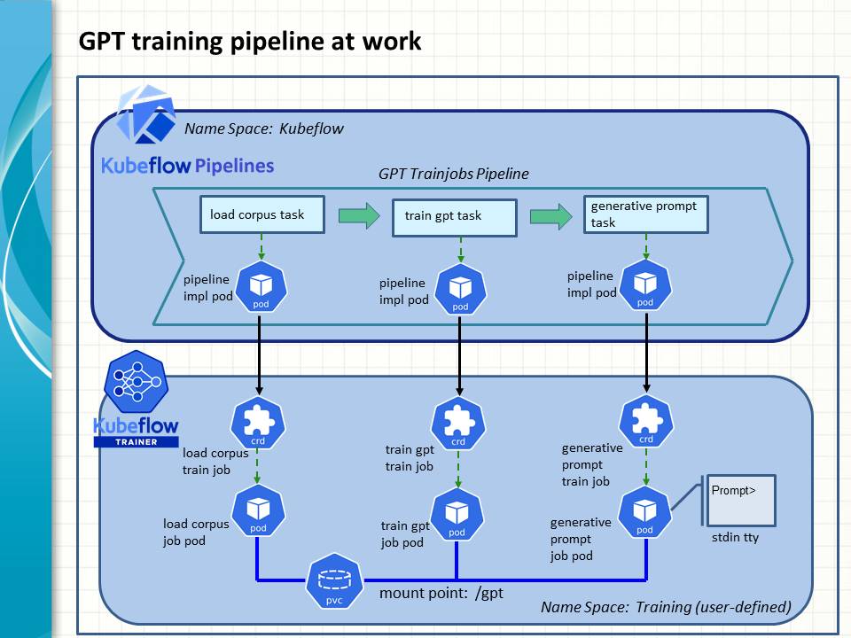

## GPT Training Pipeline

A Kubeflow pipeline is implemented to train up a GPT model from scratch and use it to generate text in response to user prompts. It consists of these task components in order
1. Load corpus data
2. Create and train up a GPT model
3. Run an interactive prompt session to generate text

### TL; DR



### Setup overview

The steps and artifacts taken to build and run the the pipelines are similar those involved in our earlier example of a pipeline of multiple train jobs (see [here](../multiple/readme.md)). You may customise the training data and model hyperparameters by modifying the pytorch scripts to suit your needs. 

In this exercise, we want to minimize the lead time to see quick results. Only a piece of a short literature work, namely Williams Shakespeare's "The Comedy of Errors", is used as a corpus text to train a new GPT model. The model is also configured with small values for such hyperparameters as the number of transformer blocks, training epochs and others.

### Special considerations

There are two points about the Kubeflow Trainer resources that are deployed differently from those in our earlier examples.

First, before applying the trainingruntime and trainjob CRDs, it is necessary to set up a persistent volume claim (PVC) in the Kubernetes cluster. This will enable the ensuing trainjob pods to share the training data and model via a mount point of a persistent volume. To this end, a suitable storageclass is required to support the PVC.

You may consider install the local-path storageclass provided by Rancher, if you don't have a proper one to start with,
```
kubectl apply -f https://raw.githubusercontent.com/rancher/local-path-provisioner/v0.0.31/deploy/local-path-storage.yaml
kubectl patch storageclass local-path -p '{"metadata": {"annotations":{"storageclass.kubernetes.io/is-default-class":"true"}}}
```

Create a PVC claim to a persistent volume of 128 MB. It will be mounted on the mount point /gpt by the trainjob pods.
```
kubectl apply -f - <<EOF
apiVersion: v1
kind: PersistentVolumeClaim
metadata:
  name: gpt-pvc
  namespace: training
spec:
  accessModes:
    - ReadWriteOnce
  resources:
    requests:
      storage: 128Mi
```

The second point to note is, the worker pod that performs the generative prompt job at the end of the pipeline needs to run in an active mode to generate text in response to user prompts. To this end, the pod is to be assigned a terminal to process standard I/O when it starts up. This is done by enabling the stdin and tty settings for the container enclosed in the trainingruntime CRD, generative-prompt-runtime, (see [generative_prompt_job.yaml](generative_prompt_job.yaml))

```
spec:
  containers:
  - name: generative-prompt-container
    image: snpsuen/toy-gpt:latest
    imagePullPolicy: IfNotPresent
    command: ["python", "/workspace/call_generative_prompt.py"]
    stdin: true
    tty: true
```

### Running the pipeline
