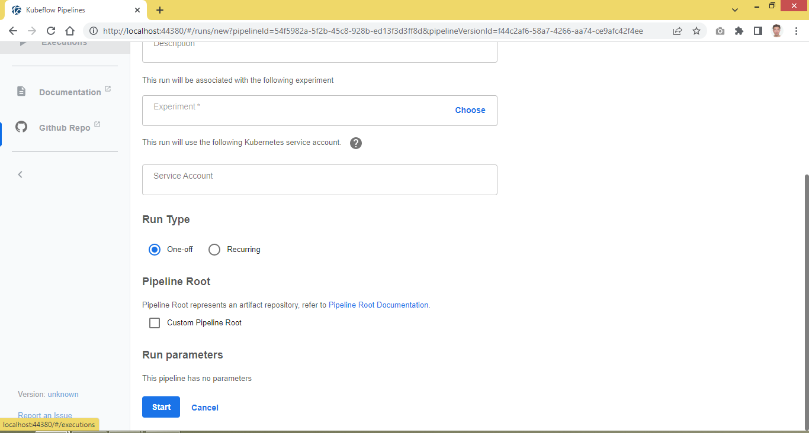

## Pipeline for running multiple train jobs

A more realistic approach is to break down a monolithic pipeline into a workflow of multiple train jobs. To start with, let's consider a ML life cycle that is typically driven by the following pipeline components in order.
1. Load raw data
2. Slice and dice data sets to prepare for training
3. Train up a DL model
4. Use the model to forecast

Hope the exercise can serve as a template for building other pipelines that involve similar train jobs. 

### TL; DR


### Containerize your subject-specific DL source code

Place the pytorch scripts in a suitable environment as per the directory layout below.
```
workspace/
├── simple_train_lib.py
├── call_train_lib.py
├── call_load_data.py
├── call_prepare_data.py
├── call_train_model.py
└── call_model_forecast.py
```

Package the scripts into a docker image, which will be used to spin up the train job worker pods. The entry point command specified here is only a filler and will certainly be overrided when a pod is created from the image to perform a specific train job. In this example, the image is tagged snpsuen/call_train_lib:02.
```
cat > Dockerfile <<EOF
FROM python:3.13.5-slim-bookworm
RUN pip install torch==2.6.0 torchvision==0.21.0 torchaudio==2.6.0 --index-url https://download.pytorch.org/whl/cpu && pip install pandas matplotlib
RUN apt-get update && apt-get install -y nano procps
WORKDIR /workspace
COPY . .
CMD [ "python", "./call_train_lib.py"]
EOF

docker build -t snpsuen/call_train_lib:02 .
```

### Define Trainjob and Trainingruntime CRDs

Refer to the following manifests in this repo directory for the TrainJob and TrainingRuntime CRDs defined to serve the corresponding train jobs in the pipeline.
1. [load_data_job.yaml](load_data_job.yaml)
2. [prepare_data_job.yaml](prepare_data_job.yaml)
3. [train_model_job.yaml](train_model_job.yaml)
4. [model_forecast.yaml](model_forecast.yaml)

All train jobs are eventually implemented by job pods that share the same docker image but start with different entry point commands.
<table>
	<tr>
		<th scope="col" align="left">Manifest</th>
		<th scope="col" align="left">TrainJob CRD</th>
		<th scope="col" align="left">TrainingRuntime CRD</th>
		<th scope="col" align="left">Job Pod</th>
		<th scope="col" align="left">Docker Image</th>
		<th scope="col" align="left">Entry Point Command</th>
	</tr>
	<tr>
		<td align="left">load_data_job.yaml</td>
		<td align="left">load-data-job</td>
		<td align="left">load-data-runtime</td>
		<td align="left">load-data-pod</td>
		<td align="left">snpsuen/call_train_lib:02</td>
		<td align="left">python ./call_load_data.py</td>			
	</tr>
	<tr>
		<td align="left">prepare_data_job.yaml</td>
		<td align="left">prepare-data-job</td>
		<td align="left">prepare-data-runtime</td>
		<td align="left">prepare-data-pod</td>
		<td align="left">snpsuen/call_train_lib:02</td>
		<td align="left">python ./call_prepare_data.py</td>
	</tr>
	<tr>
		<td align="left">train_model_job.yaml</td>
		<td align="left">train-model-job</td>
		<td align="left">train-model-runtime</td>
		<td align="left">train-model-pod</td>
		<td align="left">snpsuen/call_train_lib:02</td>
		<td align="left">python ./call_train_model.py</td>
	</tr>
	<tr>
		<td align="left">model_forecast_job.yaml</td>
		<td align="left">model-forecast-job</td>
		<td align="left">model-forecast-runtime</td>
		<td align="left">model-forecast-pod</td>
		<td align="left">snpsuen/call_train_lib:02</td>
		<td align="left">python ./call_model_forecast.py</td>
	</tr>
</table>

To facilitate passage of data from one job pod to another, pytorch objects returned by a pod, mostly in the form of various data sets or models, are written to a file system via torch.save(). They are subsequently fed into the receving pod using torch.load().

We go for a quick and dirty option whereby a designated hostpath volume, /var/tmp/pytorch, is shared by the job pods via the container mount point /pytorch. To ensure all the pods will access the same copy of the hostpath volume throughout the pipeline, we schedule them explicitly to run on the same Kubernetes node by hardcoding the nodename field of the pod template, namely template.spec.nodename. 

This rather ugly approach can be refined by using an NFS volume to share data between the job pods. We will leave it to later discussion.

### Set up a Kubeflow pipeline

We proceed to set up a Kubeflow pipeline based on the KFP script, [poly_trainjobs_pipeline.py](poly_trainjobs_pipeline.py). As expected, there are four pipeline components in total and each will run as a pod from the same docker image where kubectl is invoked to create the designated TrainJob and TrainingRuntime CRDs.

<table>
	<tr>
		<th scope="col" align="left">Pipeline Component</th>
		<th scope="col" align="left">Docker Image</th>
		<th scope="col" align="left">kubectl Command</th>
	</tr>
	<tr>
		<td align="left">launch_load_data_trainjob</td>
		<td align="left">snpsuen/python-3.10-kubectl:v01</td>
		<td align="left">kubectl apply -f load_data_job.yaml</td>			
	</tr>
	<tr>
		<td align="left">launch_prepare_data_trainjob</td>
		<td align="left">snpsuen/python-3.10-kubectl:v01</td>
		<td align="left">kubectl apply -f prepare_data_job.yaml</td>
	</tr>
	<tr>
		<td align="left">launch_train_model_trainjob</td>
		<td align="left">snpsuen/python-3.10-kubectl:v01</td>
		<td align="left">kubectl apply -f train_model_job.yaml</td>
	</tr>
	<tr>
		<td align="left">launch_model_forecast_trainjob</td>
		<td align="left">snpsuen/python-3.10-kubectl:v01</td>
		<td align="left">kubectl apply -f _model_forecast_job.yaml</td>
	</tr>
</table>

An important consideration is to establish dependency between the pipeline components so that they will be executed in the desirable order. This is evident from the definition of the pipeline function in the KFP script.
```
def poly_trainjobs_pipeline():
    load_data_task = launch_load_data_trainjob()
    prepare_data_task = launch_prepare_data_trainjob()
    train_model_task = launch_train_model_trainjob()
    model_forecast_task = launch_model_forecast_trainjob()

    prepare_data_task.after(load_data_task)
    train_model_task.after(prepare_data_task)
    model_forecast_task.after(train_model_task)
```

In this way, a pipeline component is ready to pass the floor to the following component only after the TrainJob CRD it created is observed to have reached the Complete status. For example, the pipeline will wait for load-data-job to complete before progressing to prepare_data_task.
```
command = "kubectl -n training get trainjob load-data-job -o=jsonpath='{.status.conditions[*].type}'"
while (subprocess.check_output(command, shell=True, text=True) != "Complete"):
	time.sleep(1)
```
Finally, run python on the script to compile it into a yaml file, [poly_trainjobs_pipeline.yaml](poly_trainjobs_pipeline.yaml).

Now we can move on to the next step of running the pipeline on Kubeflow Pipelines.

### Try it out on Kubeflow Pipelines

Upload the pipeline yaml, [poly_trainjobs_pipeline.yaml](poly_trainjobs_pipeline.yaml), via the UI to Kubeflow Pipelines.


Start a run of the pipeline.




Observe the pipeline completed after 6 mins or so.

